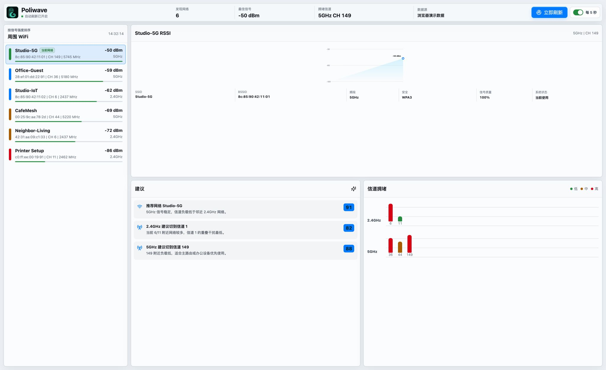

# Poliwave

English | [简体中文](./README.zh-CN.md)

Poliwave is a Tauri + Rust desktop WiFi signal analyzer MVP.



## Features

- Scan nearby WiFi networks from the Rust backend.
- Sort networks by RSSI signal strength.
- Detect 2.4GHz, 5GHz, and 6GHz bands from channel or frequency.
- Show how many nearby WiFi BSSIDs were observed on each channel without treating the count as actual channel load.
- Track RSSI history in the frontend and render a curve for the selected BSSID.
- Describe the current connection using its signal strength and security type, with a shortcut to system WiFi settings when needed.
- Diagnose WiFi, default gateway, DNS, and internet connectivity on demand, including latency and packet loss when available.
- Distinguish location permission, disabled WiFi, missing-adapter, and generic scan failures, with guided recovery actions.

## Runtime scanning sources

Poliwave currently supports macOS and Windows:

- macOS: CoreWLAN, with a Location Services prompt so macOS can return real SSIDs; legacy system commands are retained as a fallback
- Windows: `netsh wlan show networks mode=bssid`

When opened in a normal browser during development, the app uses demo data so the UI can be tested without Tauri.

## Diagnostics and privacy

Nearby WiFi scan results stay in local memory and are never uploaded. Only when the user explicitly runs the one-click diagnostic does Poliwave make standard DNS, ICMP, and TCP connectivity probes. The current targets are `example.com`, `1.1.1.1`, and `223.5.5.5`. These probes do not upload scan results or user content, and TCP reachability is used when ICMP is unavailable.

## Local build

### Prerequisites

- Node.js 20+ and npm
- Rust stable toolchain with Cargo
- macOS Tauri prerequisites: Xcode Command Line Tools

On macOS, install Rust with:

```bash
brew install rustup
brew link --force rustup
rustup toolchain install stable
rustup default stable
```

Install frontend dependencies:

```bash
npm install
```

### Development

Browser-only UI development, uses demo WiFi data:

```bash
npm run dev
```

Desktop development, uses the real Rust WiFi scanner:

```bash
npm run tauri:dev
```

### Build frontend only

```bash
npm run build
```

Output:

```text
dist/
```

### Build macOS app

```bash
npm run tauri:build
```

Output:

```text
src-tauri/target/release/bundle/macos/Poliwave.app
```

To share the macOS app as a zip:

```bash
cd src-tauri/target/release/bundle/macos
ditto -c -k --sequesterRsrc --keepParent "Poliwave.app" "Poliwave.zip"
```

### Build Windows x64 package from macOS

This project can cross-compile a Windows x64 `.exe` from macOS with `cargo-xwin`.

Install the extra tools once:

```bash
rustup target add x86_64-pc-windows-msvc
brew install llvm nsis
cargo install cargo-xwin
```

Build the Windows executable:

```bash
PATH="/opt/homebrew/opt/llvm/bin:$HOME/.cargo/bin:$PATH" \
  npm run tauri -- build --runner cargo-xwin --target x86_64-pc-windows-msvc --ci
```

Output:

```text
src-tauri/target/x86_64-pc-windows-msvc/release/poliwave.exe
```

Create the shareable Windows zip:

```bash
mkdir -p release/windows-x64
cp src-tauri/target/x86_64-pc-windows-msvc/release/poliwave.exe "release/windows-x64/Poliwave.exe"
COPYFILE_DISABLE=1 LC_ALL=C LANG=C \
  sh -c 'cd release && zip -X -r "Poliwave-Windows-x64.zip" windows-x64'
```

Output:

```text
release/Poliwave-Windows-x64.zip
```

The Windows build is unsigned. SmartScreen may warn on first launch.
