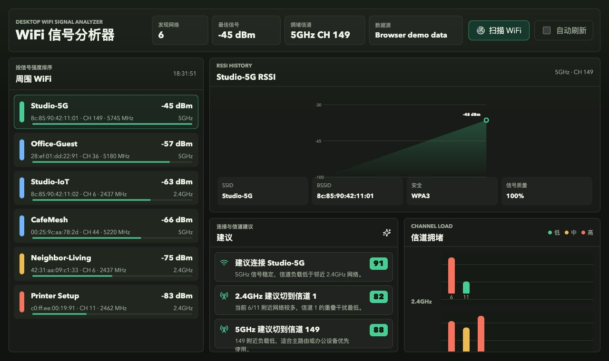

# WiFi 分析器

[English](./README.md) | 简体中文

基于 Tauri + Rust 的桌面端 WiFi 信号分析器 MVP。



## 功能特性

- 通过 Rust 后端扫描附近的 WiFi 网络。
- 按 RSSI 信号强度对网络进行排序。
- 根据信道或频率识别 2.4GHz、5GHz 和 6GHz 频段。
- 展示信道拥塞情况和信号负载。
- 在前端记录 RSSI 历史，并为选中的 BSSID 绘制信号曲线。
- 推荐应连接的 WiFi 以及应切换到的信道。

## 运行时扫描来源

- macOS：使用 CoreWLAN，并请求定位服务权限以读取真实 SSID；旧版系统命令仅作为兼容回退
- Windows：`netsh wlan show networks mode=bssid`
- Linux：`nmcli dev wifi list --rescan yes`，并在失败时回退到 `iw dev scan`

在开发过程中如果用普通浏览器打开，应用会使用演示数据，以便在没有 Tauri 的情况下测试界面。

## 本地构建

### 前置依赖

- Node.js 20+ 和 npm
- Rust stable 工具链和 Cargo
- macOS Tauri 依赖：Xcode Command Line Tools

在 macOS 上安装 Rust：

```bash
brew install rustup
brew link --force rustup
rustup toolchain install stable
rustup default stable
```

安装前端依赖：

```bash
npm install
```

### 开发

浏览器 UI 开发，会使用演示 WiFi 数据：

```bash
npm run dev
```

桌面端开发，会调用真实 Rust WiFi 扫描器：

```bash
npm run tauri:dev
```

### 只构建前端

```bash
npm run build
```

产物：

```text
dist/
```

### 构建 macOS App

```bash
npm run tauri:build
```

产物：

```text
src-tauri/target/release/bundle/macos/WiFi Analyzer.app
```

打包成便于分享的 macOS zip：

```bash
cd src-tauri/target/release/bundle/macos
ditto -c -k --sequesterRsrc --keepParent "WiFi Analyzer.app" "WiFi Analyzer.zip"
```

### 在 macOS 上构建 Windows x64 包

本项目可以通过 `cargo-xwin` 从 macOS 交叉编译 Windows x64 `.exe`。

一次性安装额外工具：

```bash
rustup target add x86_64-pc-windows-msvc
brew install llvm nsis
cargo install cargo-xwin
```

构建 Windows 可执行文件：

```bash
PATH="/opt/homebrew/opt/llvm/bin:$HOME/.cargo/bin:$PATH" \
  npm run tauri -- build --runner cargo-xwin --target x86_64-pc-windows-msvc --ci
```

产物：

```text
src-tauri/target/x86_64-pc-windows-msvc/release/wifi-analyzer.exe
```

生成可分享的 Windows zip：

```bash
mkdir -p release/windows-x64
cp src-tauri/target/x86_64-pc-windows-msvc/release/wifi-analyzer.exe "release/windows-x64/WiFi Analyzer.exe"
COPYFILE_DISABLE=1 LC_ALL=C LANG=C \
  sh -c 'cd release && zip -X -r "WiFi-Analyzer-Windows-x64.zip" windows-x64'
```

产物：

```text
release/WiFi-Analyzer-Windows-x64.zip
```

Windows 构建未签名，首次打开时可能触发 SmartScreen 提示。
